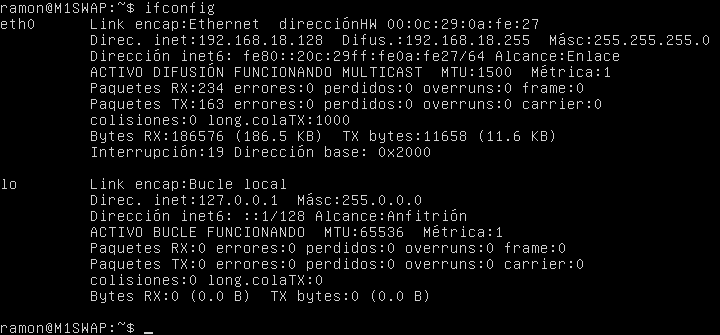
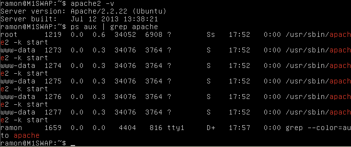
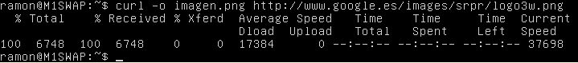
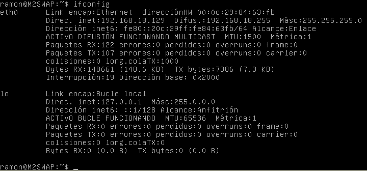
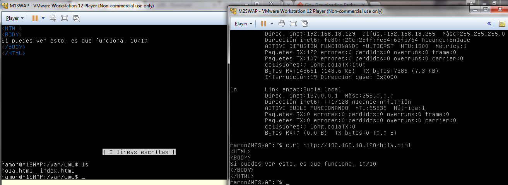
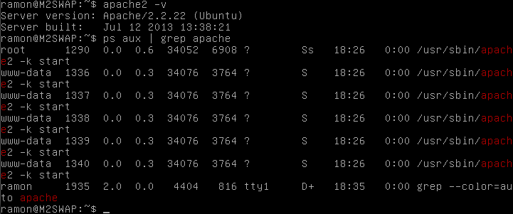

##Práctica 1: Preparación de las herramientas de la asignatura SWAD
#Autor: Ramón Sánchez García

El objetivo de esta primera práctica es la de crear y configurar dos máquinas virtuales sobre las que
trabajaremos a lo largo del curso. Para ello he usado:

* VMware para las máquinas virtuales
* Ubuntu Server 12.04

He creado dos máquinas virtuales, M1SWAP y M2SWAP, en las cuales he instalado también un LAMP Server
junto a un OpenSSH (que usaremos en la siguiente práctica). 

Tras la instalación y configuración de estos, compruebo que todo funcione correctamente, para ello:

#->Máquina M1SWAP

Lo primero que he hecho ha sido mirar su IP:  

En segundo lugar, ejecutro los comandos que indica el guión de prácticas, que son:
    apache -v  
    ps aux | grep apache  

De forma optativa, he instalado el paquete cURL con la orden
`sudo apt-get install curl`
para poder ver archivos y bajarlos. En la prueba siguiente hago esto último, bajar una imagen remota:

Por último, en el directorio /var/www he creado un html de prueba para poder visualizarlo
en la segunda máquina con cURL.

#->Máquina M1SWAP

Realizo las mismas acciones que he hecho en la máquina anterior, hasta instalar el cURL.

Obtengo la IP:

Instalo el paquete cURL y lo pruebo. Para ello voy a usar esta vez el comando
`curl http://192.168.18.128/hola.html`
donde esa es la ip de la primera máquina, y lo siguiente es el nombre del archivo html que creamos:

Por último vuelvo a comprobar que el servidor apache está funcionando en esta máquina:

