##Práctica 4: Comprobar el rendimiento de servidores web
#Autor: Ramón Sánchez García

Tal y como dice el titulo, el objetivo de esta cuarta práctica es el de comprobar el rendimiento de servidores web. Para ellos vamos a retomar nuestras 
máquinas virtuales con todos sus servidores instalados y configurados como hicimos en las prácticas anteriores. Además es importante tener configurados 
los balanceadores de carga tal y como hicimos en la [Práctica 3](https://github.com/Chentaco/asignaturaswap/blob/master/Practicas/P3/Practica3.md).

En esta práctica 4 hemos realizado las siguientes tareas:  

* Usar Apache Benchmark para comprobar el rendimiento, tanto de un servidor concreto como usando tanto nginx como hproxy (de la anterior práctica).  
* Realizar lo mismo que en el punto anterior, pero usando Siege.  
* Optavivo: Realizar las mismas pruebas pero con un programa extra, en mi caso he usado OpenWebLoad.  
  
Para ello, y antes de empezar, he realizado un documento html llamado "prueba.hmtl" en el directorio /var/www/ en ambas máquinas 
servidoras (recordemos que son M1 y M2):  
  
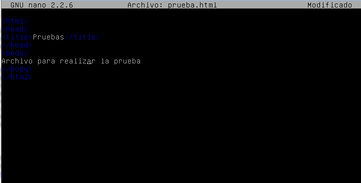  
  
Hecho esto, vamos a realizar las pruebas desde la máquina REAL (también se puede crear una M4 y realizarlas desde ella). Yo, por simple comodidad, las he 
hecho en la máquina real, un Windows 7 desde el que trabajaremos en linea de comandos.  

#Comprobando el rendimiendo con Apache Benchmark

El primer método que he usado es el de Apache Benchmark, herramienta incluida con la instalación de Apache. Para más información, visita el siguiente 
[link](http://httpd.apache.org/docs/2.2/programs/ab.html).  
Para empezar a utilizarlo, iremos al directorio donde tenemos apache (normalmente C:\ o Program Files), y dentro de la carpeta, buscamos otra llamanda "bin". 
Dentro de esta debería estar un ejecutable "ab.exe". Para hacerlo funcionar, una vez hemos entrado al directorio **por línea de comandos**, usamos el siguiente 
comando:  
```
ab -n 1000 -c 10 http://ipmaquina/prueba.html
```  
Donde:  
* ab es la herramienta  
* -n 1000 es el número de peticiones a la dirección web  
* -c 10 la cocurrencia de las peticiones (de 10 en 10)  
* http://ipmaquina/prueba.html la dirección a la que le haremos la prueba, en nuestro caso 192.168.18.128 para la M1 (servidora) y 192.168.18.130 para 
la M3 (la del balanceador). Mientras que prueba.html es el archivo de prueba que hemos creado antes.  

  
Si ejecutamos el comando, nos saldrá algo como esto:  
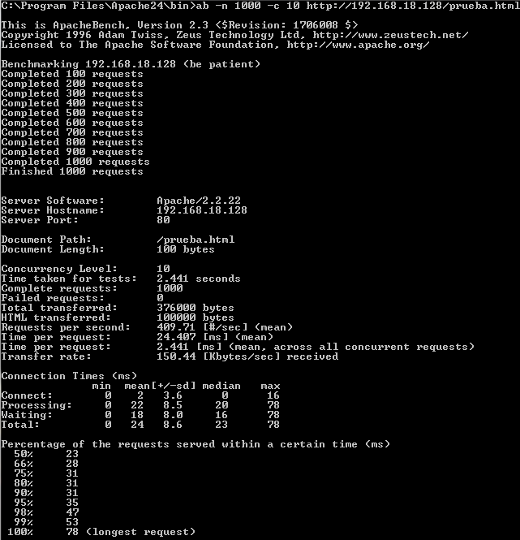  
  
Entre todos estos datos, para la comparativa nos vamos a quedar con **"Time taken for tests"**, **"Failed requests"**, 
**"Requests per second"** y **"Time per request"**.  
  
Para cada tipo de escenario (servidor directa, con nginx y hapache) he realizado 10 pruebas distintas (solo en el caso de Apache Benchmark como veremos) 
que recojo en la siguiente tablas:  
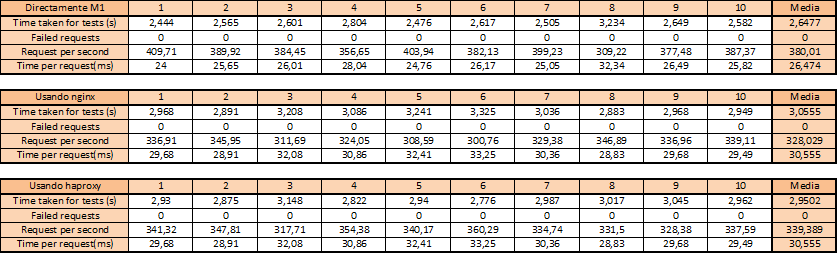  

Ahora, para una mejor comparativa, recojo una comparativa con la media de cada escenario con Apache Benchmark, en la siguiente gráfica:  
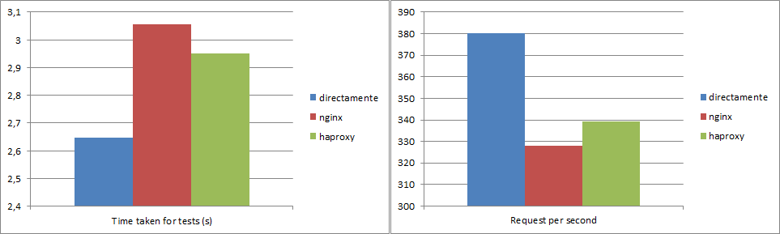  
Como los demás datos son iguales, no he hecho gráfica para ellos.  
Podemos observar como claramente la conexión directa con el servidor es mucho más rápida que usando un servidor intermedio para distribuir la carga. 
Tarda mucho menos tiempo directamente haciendo las peticiones y realiza muchas más que usando el balanceador de carga. También podemos ver 
que hay haproxy tarda menos que nginx en hacer las peticiones.  


**NOTA 1**: Es MUY importante fijarse que cuando hagamos las pruebas a la máquina balanceadora, esta tenga encendida el servicio correspondiente y los demás 
estén apagados. Cada vez que probemos uno distinto, apagamos los otros, para evitar colisiones.  
**NOTA 2**: Es curioso como, al realizar una prueba con nginx activo, como Apache Benchmark nos dice que el balanceador está activo:  
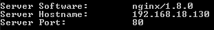  

#Comprobando el rendimiendo con Siege  

Toca cambiar de herramienta, ahora le toca a Siege. Para información sobre esta herramienta, consulta el siguiente [enlace](https://www.joedog.org/siege-home/).  

Aunque parece similar a la herramienta de Apache, presenta opciones de ejecutción algo diferentes. Para utilizarla, tras descargarlo, entramos al directorio 
en el que está el .exe y ejecutamos el siguiente comando:  
```
siege -b -t60S -v http://ipmaquina
```  
Donde:  
* -t60S es para indicarle que durante 60 segundos, va a estar realizando las pruebas.
* http://ipmaquina, en esta ocasión será directamente a la máquina que queremos hacerle las pruebas la que pondremos (la de 128 y la de 130).  
Además, por defecto, utiliza 15 usuarios para realizar las peticiones.  

Tras ejecutarlo, tendremos algo como esto:  
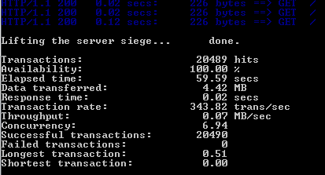  
Nos quedamos con **"Availability"**, **"Elapsed time"**, **"Response time"** y **"Transaction rate"**.  
  
Realizamos las baterías de pruebas a los mismos escenarios que con la herramienta del apartado anterior.  
**NOTA 3**: Al parecer, la carpeta de siege-windows debe estar en C:\ directamente. Si intentamos ejecutarlo desde otro directorio, nos saldrá el siguiente 
mensaje:  
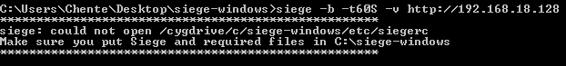  
**NOTA 4**: Por temas de tiempo (cada prueba dura un minuto) y que a veces salian errores, he optado por realizar 5 pruebas de cada escenario en lugar de 
10 como hice con Apache Benchmark.  
  
Recojo los datos de nuevo en las siguientes tablas y realizo la comparativa en los gráficos siguientes:  
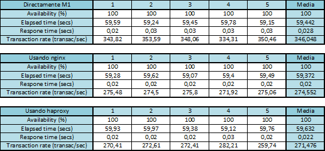    
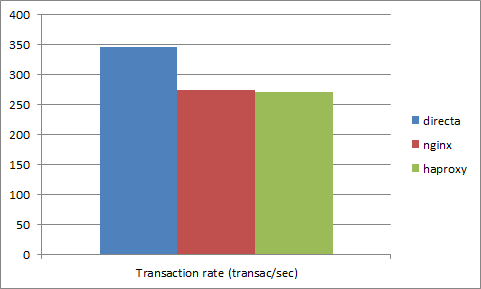  
Al igual que en el apartado anterior, solo he hecho gráfica para aquellos datos que considero que se tienen que comparar y no son demasiado iguales.  
De nuevo, el número de transiciones por segundo es mejor si está conectado directamente que usando los balanceadores. En este caso, nginx es un poquito mejor 
que haproxy.  

#Opcional: Comprobando el rendimiento con OpenWebLoad  
La herramienta opcional que he usado es la que cita el titulo. La documentación está en [este enlace](http://openwebload.sourceforge.net/#how).  
Yo he utilizado el comando con los parámetros por defecto, donde utiliza 5 clientes:  
```
openload http://ipmaquina
```  
Tras realizar una ejecución, obtenemos los siguientes datos:  
De aquí me he quedado con **"Total TPS"**, **"Avg. Response time"** y **"Max Response Time"**.  
**NOTA 5**: Las peticiones de OpenWedLoad NO paran. Para hacerlo hay que presionar ENTER. Yo lo he hecho cada **5 peticiones**.  
Una vez más, los resultados y la comparativa con gráficas está recogida en el siguiente apartado:  
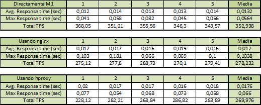   
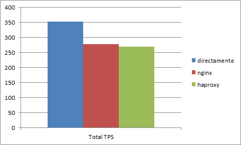   

Solo he realizado la gráfica para el Total TPS (Transmision per second). El resultado es muy parecido al que obtimos anteriormente. La conexión directa 
sigue siendo la mejor, realiza muchas más transmisiones por segundo que con el balanceador.

