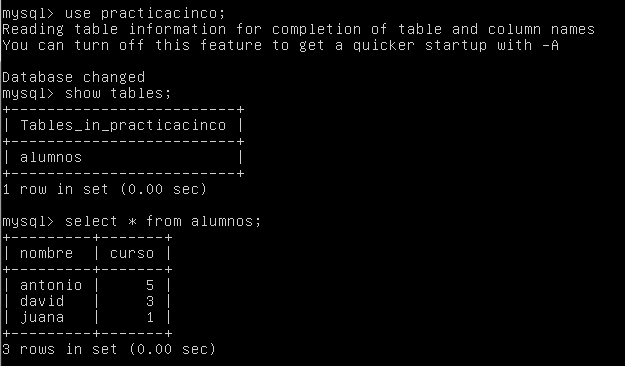
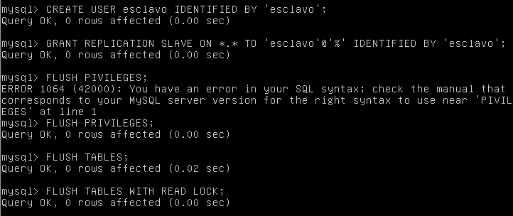

##Práctica 5: Replicación de bases de datos MySQL
#Autor: Ramón Sánchez García

El objetivo de esta quinta práctica es la de realizar copias de seguridad de las bases de datos entre las máquina servidora y la cliente, usando la técnica de "maestro-esclavo". Tendremos una base de datos en el servidor y realizaremos copias de ella sin que se vea afectada por ningún cambio hacia los servidores clientes.  Para ello he usado dos métodos distinto de realizar estas copias de seguridad entre servidor maestro y servidor esclavo, manual y automática. También, opcionalmente, he realizado una configuración maestro-maestro, entre dos servidores, donde los cambios en cada servidor influirán en el otro.  
  
Los objetivos de la práctica se dividen en:  

* Clonar la máquina virtual desde la maestra a la cliente de forma manual mediante **mysqldump**.
* Realizar el clonado automáticamente, configurando el servicio con la configuración maestro-esclavo.
* Opcional: Realizar el clonado automáticamente, pero esta vez usando el método maestro-maestro.   

Para el desarrollo de la práctica, utilizo las Máquinas configuradas para prácticas anteriores (en concreto **M1**, que será la maestra y **M2**, que será la esclava). En esta ocasión nos vamos a centrar en el uso de MySQL, el cual instalamos a la hora de creación de las máquina en la [Práctica 1](https://github.com/Chentaco/asignaturaswap/blob/master/Practicas/P1/Practica1.md).  

#Creando la base de datos  

En caso de que no tengamos ninguna base creada en el servidor, como es nuestro caso, vamos a proceder a crearla. En caso de que ya tengas una creada, al menos en la máquina maestra, no es necesario hacer este paso.  

Desde la máquina maestra (en mi caso M1) accedemos al "terminal" de mysql:  

```
mysql -u root -p  
```  

Al entrar, al promp nos indicará que estamos trabajando en **mysql** y tenemos que usar sentencias del mismo. Por ejemplo, yo he creado una base de datos llamada **practicacinco** y he creado una tabla dentro de ella llamada **alumnos** con las columnas **nombre** y **curso**:  
  
Después he metido varios datos de prueba:  
  

Ya tendríamos lista nuestra base de datos de prueba y nos vale para realizar sobre ella las pruebas de esta práctica. Vamos a ver como replicarla en el siguiente apartado.

#Replicando nuestra base de datos de forma manual

Una primera opción que nos ofrece la práctica es la de copiar el directorio de la base de datos a la otra máquina usando **tar czf**, como ya vimos en la [Práctica 2](https://github.com/Chentaco/asignaturaswap/blob/master/Practicas/P2/Practica2.md) mediante **ssh**, pero este método no es muy útil, como vimos, para cantidades muy grandes de información.  

La opción más correcta es usar **mysqldump**. Con ella podremos exportar nuestra base de datos desde la máquina master a la esclava. Para ello lo primero que tenemos que hacer es "bloquear" nuestra base de datos para que, al hacer la sincronización, no se actualicen los datos. Entramos al mysql de la M1 y las bloqueamos:  
  
  
Tras ello, ejecutamos el siguiente comando:  
 

Como vemos, está en el directorio **root**. Si lo deseamos, además podemos desbloquear la base de datos para que se siga actualizando:  
 

Ahora hay que ir a la M2, la esclava, y traernos la copia de la base de datos que acabamos de hacer. Por lo tanto ejecutamos desde la segunda máquina:  
  
Como se puede observar en la captura, estamos usando la dirección IP de la M1.  
  
Ya que tenemos el backup en la M2, procedemos a realizar el mysqldump:  
  
  
  
**NOTA 1:** Antes de realizar el paso anterior, hay que crear o tener la base de datos. Si no tenemos base de datos, la creamos:  
  
  
  
Si todo ha ido bien, ya tendríamos una copia de seguridad de nuestra base de datos de la máquina maestra. Podemos comprobarlo mirando el contenido de esta:  
  
  
Es un buen método para realizar copias de seguridad, pero todo es manual. Cada vez que esta sea modificada, y queramos recuperar esos datos, tenemos que volver a realizar todo este proceso, siempre y cuando queramos hacer backup de cualquier cambio. Si queremos que lo haga a tiempo real, tras cada cambio, podemos automatizarlo  con un método maestro-esclavo como vamos a ver en el siguiente apartado.

#Replicando nuestra base de datos automáticamente mediante la configuración maestro-esclavo
  
MySQL ofrece la posibilidad de poder realizar el clonado o la réplica de la base de datos de forma automática, de forma que el maestro hará la copia sobre el esclavo. Para realizar la configuración, empezamos editar el archivo */etc/mysql/my.cnf/* tanto de la M1 como de la M2, donde:   

* Comentamos (con un #) la línea **bind-address 127.0.0.1**.  

* Ponemos el **server-id = 1**, en la M1, y **server-id = 2**, en la M2, y nos aseguramos que no esté la línea comentada en ninguno de los servidores.  

* Nos aseguramos que las líneas **log_error = /var/log/mysql/bin.log** y **/var/log/mysql/error.log** no están comentadas, y que son estos los directorios indicados (aunque que cada uno ponga el que quiera).  

Hecho los cambios, reiniciamos el servicio con:  
```
/etc/init.d/mysql restart
```  


**NOTA 2**: Los cambios hay que hacerlos desde el el super usuario, o como root.  
**NOTA 3**: Aunque podemos reiniciar mysql con el comando antes indicado, también podemos usar ``` service mysql restart ```.  

  
Si todo ha ido bien, no debería haber salido ningún error al reiniciar. Pasamos ahora a ejecutar las siguientes sentencias:  
  
  
Muy importante fijarse en los datos de esta última tabla. Los vamos a necesitar para la siguiente configuración que realizamos ahora **DESDE LA M2**:  
  
Los parámetros de masterlogfile y masterlogpost serán diferentes en cada caso, hay que mirar en la M1 en SHOW MASTER STATUS. Además hay que poner la ip en masterhost de nuestra M1.  
  
Iniamos el esclavo con ``` START SLAVE``` y desbloqueamos las tablas de la M1 con ```UNLOCK TABLE```. Si queremos saber si todo ha ido correcto, ejecutamos en la M2 el comando ```SHOW SLAVE STATUS\G``` y si todo se ha configurado bien, en el apartado **secondsbehindmaster** debería salir un valor DISTINTO de *NULL*:  
  
  
Si todo ha ido bien, podemos añadir a nuestra tabla de la base de datos un valor desde la M1 y verlo al momento en la M2:  
 
  
Sin embargo, desde la esclava no podremos editar la base de datos. Si queremos poder editar desde ambas máquinas, la configuración que tenemos que poner en las de maestro-maestro, que explico en el siguiente apartado.

#Opcional: Configuración master-master

En el paso anterior, hemos configurado nuestros servidores M1 y M2 de forma maestro y esclavo. Pero, ¿cómo configurarlo maestro-maestro? Es muy sencillo: hay que configurar el usuario "esclavo" en ambas máquinas para que pueda editar tanto desde la M1 a la M2 y viceversa. Hemos configurado en el paso anterior de forma que si edito en el servidor maestro, vea lo que pasa en el servidor esclavo, lo que hay que hacer es LO MISMO para el mismo usuario pero desde la M2. Ejecutamos en la M2:  
  
  

Y ahora, en la M1, la que era nuestra maestra, ejecutamos:  
  
 
Como hemos visto en las capturas, el usuario es el mismo que en la maestro-esclavo, y que ya partimos de la configurada en dicho apartado. Al realizar esta sentencia, si todo ha ido bien, podemos comprobar que podemos añadir desde la M1 datos a la base de datos y verla desde la M2:  
  

Y viceversa:  
  
  
Fuente: https://www.digitalocean.com/community/tutorials/how-to-set-up-mysql-master-master-replication

