##Práctica 6: Discos en RAID
#Autor: Ramón Sánchez García

En esta práctica he configurado un RAID en la Máquina 1 realizada en prácticas anteriores. En concreto un RAID 1 usando software. Antes de empezar, he añadido a la M1, estando apagada, dos disco de 4 GB desde el propio asistente de WMware:  
  
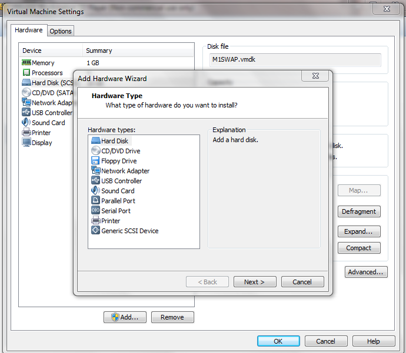   
  

Tras eso, podemos encender la máquina y empezar a trabajar con esta práctica. Los objetivos que he llevado a cabo son los siguientes:

En esta práctica 4 hemos realizado las siguientes tareas:  

* Configuración de los dos discos en RAID 1.  
* Realizar pruebas sobre estos discos (retirada en caliente, simular fallos) y comprobar que el RAID sigue funcionando.  
* Optavivo: Configuración de un servidor NFS y usar un cliente para configurar el RAID.  

Utilizamos como he dicho la M1 como servidor, y en el caso de cliente para la parte opcional, he utilizado la M2.  
   

#Configuración del RAID

Arrancamos la M1, con los dos discos añadidos. Lo primero que hay que hacer es instalar el paquete mdadm, que será el software necesario para la configuración del RAID:  
```
sudo apt-get install mdadm
```  
El programa instala adicionalmente un servicio de correo en el caso de que queramos recibir notificaciones sobre fallos en nuestro sistema, etc.  
Una vez instalado, vamos a ver la información de los discos (para asegurarnos de que las ha detectado, por ejemplo) con el comando:  
```
sudo fdisk -l
```  
  
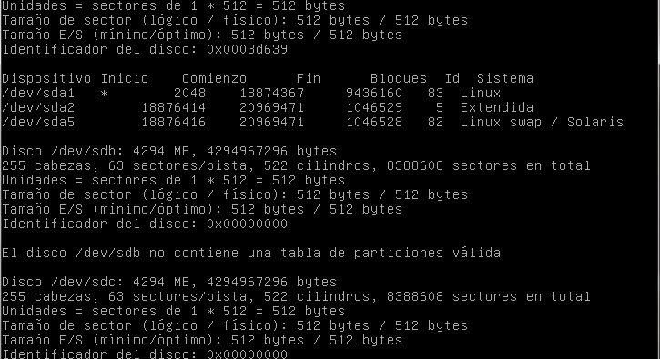   
  
Si las detecta, pasamos a configurar el RAID. Para ello lo montaremos en el dispositivo /dev/md0, indicando que vamos a usar 2 dispositivos, con el siguiente comando:  
  
```
sudo mdadm -C /dev/md0 --level=raid1 --raid-devices=2 /dev/sdb /dev/sdc  
```  

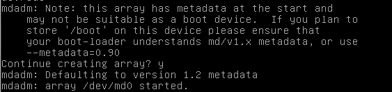  


**NOTA 1**: En mi caso se llamaban sdb y sdc, pero puede que en el caso de otros tenga otro nombre, que cada uno ponga la que corresponda.  
**NOTA 2**: El  nombre es /dev/md0 hasta que se reinicie, donde Linux lo renombrará a /dev/md127, por lo que es recomendable no reiniciar hasta haber configurado los siguientes pasos.  

Ya tenemos creado nuestro dispositivo RAID, ahora le damos formado con:  
```
sudo mkfs /dev/md0
```   
Por defecto, mfks inicializa el dispositivo con formato ext2.  
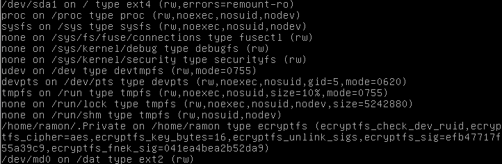  

Queda crear el directorio donde se montará la unidad de RAID. En mi caso he creado el directorio **/dat**:  
```
sudo mkdir /dat  
sudo mount /dev/md0  /dat  
```  
Y lo montamos con:  
```
sudo mount
```  
Si todo ha ido bien, no debería salirnos ningún error. Podemos ver el estado de nuestro RAID con el comando:  
```
sudo mdadm --detail /dev/md0  
```  
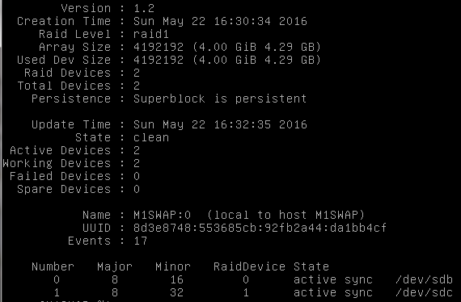  

  
Lo último que hay que realizar, es configurar el RAID para que se monte automáticamente al arrancar el sistema. Lo primero que hay que hacer es ejecutar la orden:  
```
ls -l /dev/disk/by-uuid/
```  
  
Nos mostrará una ventana como la siguiente:  
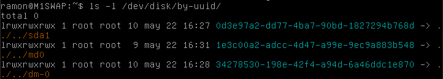  
  
Anotamos la UUID de /md0/, que es la de nuestro RAID. Después editamos el archivo **/etc/fstab/** y añadimos la siguiente linea al final:  
```
UIDD="la uid de nuestra unidad" /dat/ ext2 defaults 0 0
```  
Ya tendríamos todo. Ahora queda realizar algunas pruebas. La primera será la de simular que ha habido un error en el disco. Para ello:  
  
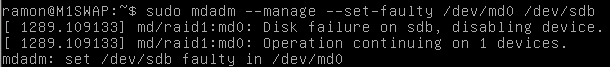  

También podemos retirar un disco en caliente:  
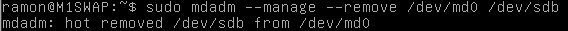  
  
Como vemos, si vemos los detalles del RAID, este sigue funcionando con el otro disco, vemos además que nos dice que está retirado:  
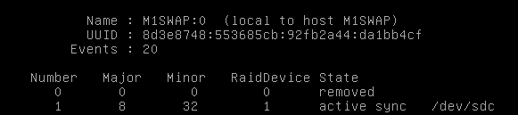  

Podemos volver a añadirlo y comprobar su funcionamiento:  
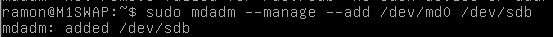  
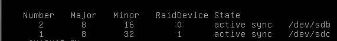  

El RAID permite que si hay algún fallo y/o se retire un disco, el otro cargue con ello. 

#Opcional: Configuración de servidor NFS

En este apartado explico como he instalado en la M1 un servidor NFS y montado la unidad usando el protocolo en la M2. Para ellos empiezo instalando en la Máquina1 el servidor:  
```
sudo apt-get install nfs-kernel-server  
```  
  

**NOTA 3**: Hay que quitarle los permisos a la carpeta donde montamos el RAID para que pueda acceder desde la Máquina 2, para ello uso el comando:  
```
sudo chown nobody:nogroup /dat/  
```  

  

Una vez instalado, editamos el fichero **/etc/exports** añadiendo la siguiente línea al final:  
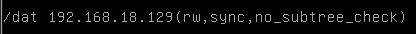  
Donde ponemos la IP de nuestra máquina cliente (en mi caso es la mostrada).
  
Ahora, desde la M2, o sea, la cliente, vamos a instalar el paquete:  
```
sudo apt-get install nfs-common  
```  

Ahora necesitamos crear el directorio (recordemos que nosotros creamos **/dat/**) y montar en él usando la IP de la M1, la máquina servidora:  
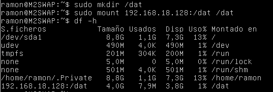  
  
**Fuente:** https://www.digitalocean.com/community/tutorials/how-to-set-up-an-nfs-mount-on-ubuntu-14-04