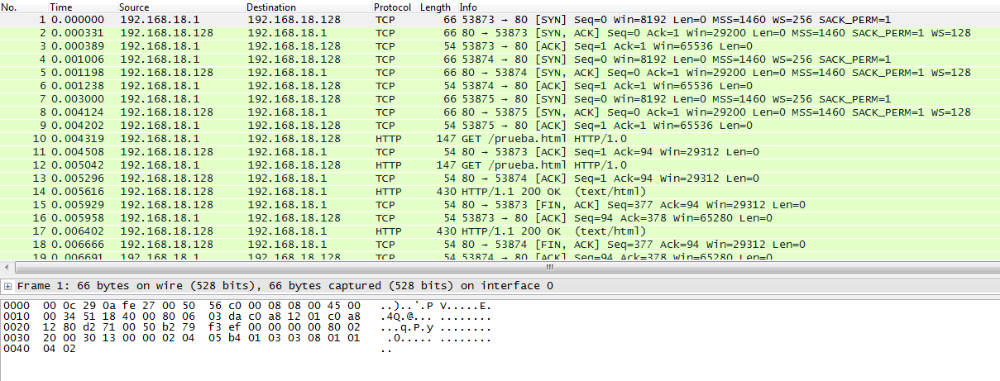

#Ejercicio 5.2: Instalar wireshark y observar cómo fluye el tráfico de red en uno de los servidores web mientras se le hacen peticiones HTTP.
He abierto una máquina servidora de las prácticas (M1), sin balanceador de carga. Desde la máquina local, le he hecho peticiones como en la
[Practica 4](https://github.com/Chentaco/asignaturaswap/blob/master/Practicas/P3/Practica4.md), con Apache Benchmark. Recuerdo que el comando era:  
```
ab -n 1000 -c 10 http://192.168.18.128/prueba.html  
```
Donde esa dirección ip es la de nuestra máquina M1.  
Además para capturar, en mi caso, la interface que he de seleccionar en Wireshark es la de **VMware Network Adapter VMnet8**.  
Podemos ver algo como esto:  

Observamos la cantidad de peticiones que hemos realizado y sus respuestas con la dirección de la máquina servidora y la local. Además empieza usando 
el protocolo TCP y acaba recibiendo la información de la página html con HTTP.