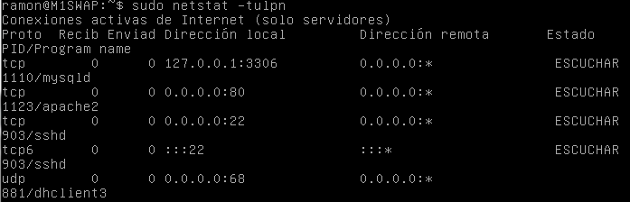

#Ejercicio T6.2: Comprobar qué puertos tienen abiertos nuestras máquinas, su estado, y qué programa o demonio lo ocupa.  
Podemos ejecutar cualquiera de los siguientes comandos:  
```
sudo lsof -i
sudo netstat -lptu
sudo netstat -tulpn
```  
Asi, ejecutando alguno de ellos, podemos ver los puertos y el estado, como vemos en la siguiente captura: 
